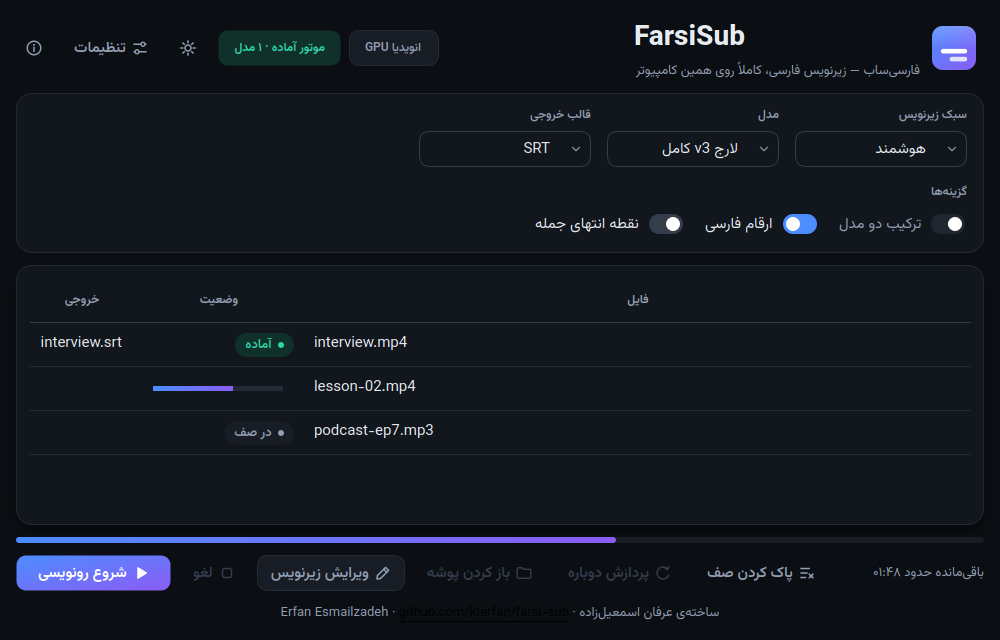
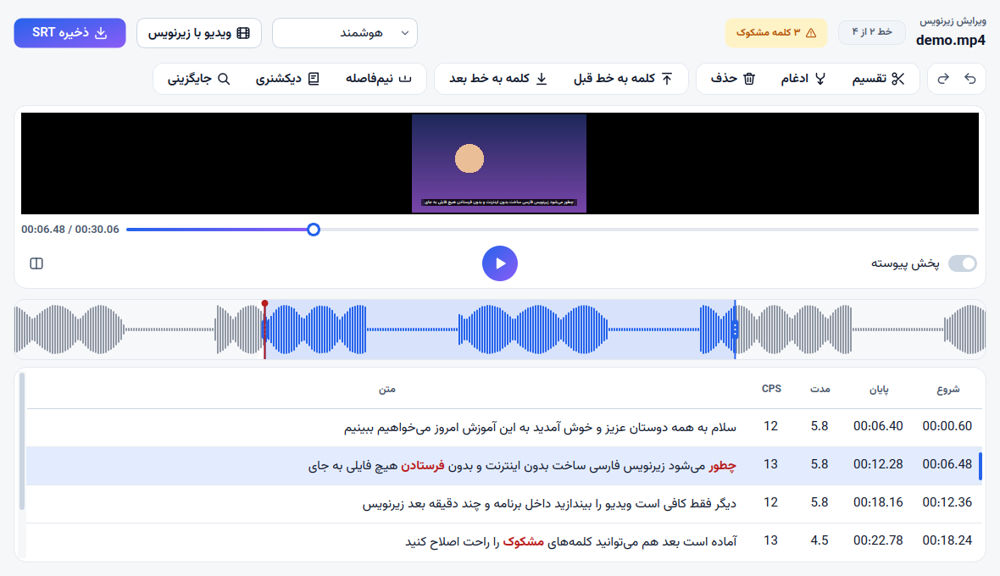

<div dir="rtl" align="center">

# فارسی‌ساب · FarsiSub

**زیرنویس فارسی از روی ویدیو و فایل صوتی — کاملاً روی کامپیوتر خودت.**
بدون ابر، بدون حساب کاربری، بدون آپلود. فایل‌هایت هرگز از کامپیوترت بیرون نمی‌رود.

[**⬇ دانلود برای ویندوز**](https://github.com/kterfan/farsi-sub/releases/latest) ·
[نصب](#نصب) · [امکانات](#امکانات) · [اجرا از سورس](#برای-برنامه‌نویس‌ها)

[English](README.md) · فارسی



</div>

<div dir="rtl">

---

## چه کار می‌کند

یک ویدیو (یا فایل صوتی) را بینداز داخل برنامه، سبک را انتخاب کن و شروع را بزن.
فارسی‌ساب گفتار فارسی را با [whisper.cpp](https://github.com/ggml-org/whisper.cpp)
می‌نویسد و فایل زیرنویسی می‌سازد که قوانین نگارش فارسی را رعایت می‌کند: نیم‌فاصله
درست، ارقام فارسی، نقطه‌گذاری. بعد می‌توانی ویرایشگر داخلی را باز کنی، ویدیو را
ببینی، اشتباه‌های مدل را اصلاح کنی و ذخیره کنی.

همه‌چیز آفلاین اجرا می‌شود. تنها کاری که به اینترنت نیاز دارد دانلود یک‌بارهٔ مدل
تشخیص گفتار در اولین اجراست.

> رابط برنامه فارسی و راست‌به‌چپ است. پروژه برای گفتار فارسی ساخته شده؛
> زبان‌های دیگر هدفش نیستند.

## نصب

۱. به **[آخرین نسخه](https://github.com/kterfan/farsi-sub/releases/latest)** برو و از
   فهرست *Assets* فایل `FarsiSub-<نسخه>-Setup.exe` را دانلود کن.
۲. اجرایش کن. دسترسی ادمین لازم نیست؛ فقط برای کاربر خودت نصب می‌شود.
۳. در اولین اجرا برنامه پیشنهاد می‌دهد یک مدل دانلود کنی (جدول پایین). یکی را انتخاب
   کن و صبر کن تمام شود — از آن به بعد آفلاین کار می‌کند.

**نیازمندی‌ها**

- ویندوز ۱۰ یا ۱۱، ۶۴ بیتی
- کارت گرافیک انویدیا توصیه می‌شود: با مدل `large-v3` روی RTX 3060 رونویسی حدود
  ۳.۴ برابر سریع‌تر از زمان واقعی است. بدون آن برنامه خودش روی CPU می‌رود که روی هر
  سیستمی کار می‌کند ولی خیلی کندتر است.
- جای خالی برای مدل (۰.۶ تا ۳.۱ گیگابایت) و خود برنامه (نصاب حدود ۳۶۰ مگابایت است)

**دربارهٔ هشدار SmartScreen.** نصاب هنوز امضای دیجیتال ندارد، پس ویندوز ممکن است
پیام «Windows protected your PC» نشان بدهد. روی **More info ← Run anyway** بزن. همهٔ
سورس در همین مخزن است و نصاب را GitHub Actions از روی همان می‌سازد
(فایل [`.github/workflows/build-windows.yml`](.github/workflows/build-windows.yml)).

به‌روزرسانی هم همین است: نصاب نسخهٔ جدیدتر را روی قبلی اجرا کن. مدل‌ها، تنظیمات و
اصلاح‌های یادگرفته‌شده‌ات می‌مانند.

### مدل‌ها

| مدل | حجم | کیفیت فارسی | سرعت |
|---|---|---|---|
| لارج v3 کامل — پیش‌فرض | ۳.۱ گیگ | بهترین | کند |
| لارج v3 فشرده | ۱.۱ گیگ | ۱ تا ۲٪ خطای بیشتر | متوسط |
| توربو کامل | ۱.۶ گیگ | زیر لارج | خیلی سریع |
| توربو q8 | ۰.۹ گیگ | زیر توربو کامل | خیلی سریع |
| توربو q5 | ۰.۶ گیگ | کمترین | خیلی سریع |

اگر مطمئن نیستی، پیش‌فرض را بردار. روی لپ‌تاپ بدون کارت گرافیک خوب، «لارج v3 فشرده»
میانهٔ معقولی است.

## امکانات

- **چهار سبک زیرنویس** — *جمله‌ای*، *هوشمند*، *ریلز فارسی* (تک‌خطی، با کلمهٔ کلیدی در
  cue جدا) و *کلمه به کلمه* — و یک سبک شخصی خودت. عوض کردن سبک هزینه‌ای ندارد: صدا
  یک بار رونویسی می‌شود و هر سبک فقط یک بار دیگر همان کلمه‌ها را می‌چیند.
- **قوانین نگارش فارسی** — نیم‌فاصله، ارقام فارسی یا لاتین، نقطهٔ پایان جمله به‌صورت اختیاری.
- **قالب‌های خروجی** — SRT، VTT، ASS (فونت، رنگ، حاشیه، رنگ کلمهٔ کلیدی)، متن ساده، و
  **ویدیو با زیرنویس سوخته** (MP4) برای اینستاگرام و جاهایی که فایل زیرنویس جدا
  نمی‌گیرند.
- **ویرایشگر داخلی**
  - ویدیو کنار متن پخش می‌شود و خط جاری روی تصویر نوشته می‌شود
  - کلمه‌هایی که مدل مطمئن نبود رنگی‌اند و `F3` تو را به بعدی می‌برد
  - تقسیم، ادغام، حذف، بردن یک کلمه به خط کناری — زمان‌ها همراه کلمه‌ها می‌روند و
    چیزی از هم نمی‌پاشد
  - لبهٔ خط را روی موج صدا بکش تا زمانش جابه‌جا شود
  - جستجو و جایگزینی در کل زیرنویس
  - واگرد و از نو بدون محدودیت
  - **دیکشنری آموزش‌پذیر:** یک بار کلمه را اصلاح کن، در همهٔ ویدیوهای بعدی هم درست می‌شود
- **ترکیب دو مدل** — مدل دوم جاهایی را که اولی ساکت مانده پر می‌کند و دربارهٔ متن
  تکراری داوری می‌کند.
- **صف** — چند فایل را با هم بینداز؛ پشت سر هم اجرا می‌شوند، با نوار پیشرفت هر فایل،
  و آیکون کنار ساعت با پیشرفت و اعلان.
- **تم روشن و تیره**؛ پنجره با صفحهٔ کوچک سازگار می‌شود و هیچ دکمه‌ای را پنهان نمی‌کند.
- **خط فرمان** برای اسکریپت‌نویسی (پایین‌تر).

ورودی‌های پشتیبانی‌شده: `mp4 mkv mov avi webm m4v wmv flv` و `mp3 wav m4a aac flac ogg opus wma`.



## داده‌هایت کجاست

کنار خود برنامه، نه در `AppData`:

```
data\models\          مدل‌های تشخیص گفتار
data\projects\        کلمه‌ها، زمان‌ها و اطمینان هر کلمه، برای ویرایش بعدی (.fsub)
data\logs\            farsisub.log و crash.log
data\glossary.json    اصلاح‌هایی که به برنامه یاد دادی
```

حذف برنامه فقط لاگ‌ها را پاک می‌کند. مدل‌ها، پروژه‌ها و دیکشنری‌ات عمداً می‌مانند تا
نصب دوباره یک دانلود ۳ گیگی خرج‌ات نکند — اگر نمی‌خواهی، پوشهٔ `data\` را خودت پاک کن.

## چطور کار می‌کند

*یک بار رونویسی، هر قدر خواستی رندر.*

```
ویدیو → PyAV (WAV 16k) → whisper.cpp → WordStream → نرمال‌سازی → قطعه‌بندی → SRT/ASS/…
                                            ↑
                                      ویرایشگر
```

whisper.cpp هر کلمه را با زمان شروع و اطمینانش برمی‌گرداند. این فهرست — *WordStream* —
در فایل `.fsub` ذخیره می‌شود. سبک، ارقام، طول خط و هر قانون دیگر فقط یک رندر از
همان است و ویرایش دستی با عوض شدن سبک از بین نمی‌رود.

---

## برای برنامه‌نویس‌ها

### اجرا از سورس

پایتون ۳.۱۲ یا بالاتر (`hazm` همین را می‌خواهد).

```bash
python -m venv .venv
.venv\Scripts\pip install -r requirements.txt
python tools/bootstrap.py --flavour cuda --skip-model     # whisper.cpp را در bin/ می‌گذارد
FarsiSub.bat                                              # پنجره
```

خط فرمان:

```bash
PYTHONPATH=src python -m farsisub.cli video.mp4 --profile smart
PYTHONPATH=src python -m farsisub.cli video.fsub --profile reels --render-only
PYTHONPATH=src python -m farsisub.cli video.fsub --profile word --format ass --render-only
PYTHONPATH=src python -m farsisub.cli --list-models
```

اگر پروژه در ویرایشگر شکل داده شده باشد، `--render-only` همان خط‌های ویرایش‌شده را
می‌نویسد و سبک فقط شکست سطر را تعیین می‌کند.

### تست

```bash
python tests/run_tests.py     # بدون نیاز به pytest
pytest tests/                 # وقتی venv ساخته شد
```

تست‌ها در یک پوشهٔ داده موقت اجرا می‌شوند (`FARSISUB_DATA`)، نه در `data\` واقعی.
تست‌های رابط به PySide6 نیاز دارند و با `QT_QPA_PLATFORM=offscreen` بدون پنجره اجرا می‌شوند.

### ساخت نصاب

push به `master` یا شاخه‌های `claude/**` نصاب را روی GitHub Actions می‌سازد و به‌عنوان
artifact به همان اجرا می‌چسباند. push یک tag مثل `v1.8.0` علاوه بر آن یک Release
عمومی با فایل نصاب هم منتشر می‌کند. ساخت دستی روی ویندوز:

```
.venv\Scripts\python.exe -m PyInstaller installer\farsisub.spec --noconfirm --distpath dist --workpath build\pyi
.venv\Scripts\python.exe installer\verify_build.py dist\FarsiSub
"C:\Program Files (x86)\Inno Setup 6\ISCC.exe" installer\farsisub.iss
```

وضعیت پروژه و کارهای باز در [HANDOFF.md](HANDOFF.md) است و تغییرات هر نسخه در
[CHANGELOG.md](CHANGELOG.md).

<details>
<summary>نکات فنی که به‌راحتی خراب می‌کنند (همه اندازه‌گیری شده‌اند، نه حدس)</summary>

- **flash attention، DTW را بی‌صدا خاموش می‌کند.** در سورس whisper.cpp اگر `flash_attn`
  روشن باشد `dtw_token_timestamps` صفر می‌شود و همهٔ `t_dtw`ها منفی یک برمی‌گردند.
  پس `-dtw` همیشه با `-nfa` می‌آید.
- **VAD داخلی whisper.cpp تایم‌لاین را جمع می‌کند.** با `--vad` کلمات بعد از سه ثانیه
  سکوت حدود ۳.۵ ثانیه زودتر برگشتند. VAD خاموش است و حذف توهم روی سکوت با نوار
  انرژی خودمان انجام می‌شود.
- **whisper-cli فقط flac/mp3/ogg/wav می‌خواند.** ویدیو باید اول با PyAV به WAV تک‌کاناله
  ۱۶ کیلوهرتز تبدیل شود.
- **DTW فقط یک زمان به ازای توکن می‌دهد** (شروع). پایان هر کلمه از روی شروع کلمهٔ بعدی
  بسته می‌شود، وگرنه cueها روی هم می‌افتند.
- زمان توکن‌ها بر حسب **صدم ثانیه** است، نه میلی‌ثانیه.
- `-ml` و `-sow` نباید فعال شوند؛ قطعه‌بندی کار ماست.
- توکن‌ها زیرکلمه‌ای‌اند؛ اطمینان هر کلمه = **کمینهٔ** احتمال توکن‌هایش.
- توکن‌های کنترلی مثل `[_TT_350]` رقم دارند و باید صریح فیلتر شوند.
- `%LOCALAPPDATA%` برای پروسه‌های سندباکس‌شده بازنویسی می‌شود؛ برای همین داده‌ها کنار
  برنامه‌اند. یک بار مدلی که دانلود شده بود در پوشهٔ خصوصی یک کانتینر افتاد و برنامه‌ای
  که کاربر اجرا می‌کرد آن را نمی‌دید.
- سیگنال Qt را با lambda وصل نکن: بدون شیء گیرنده، اسلات روی نخ کارگر اجرا می‌شود و
  دست زدن به ویجت از آنجا access violation است.
- در PySide 6.11 خطای پایتون داخل override یک `QLayout` کل پروسه را می‌کشد (segfault،
  بدون traceback).

</details>

## سازنده

طراحی و برنامه‌نویسی: **عرفان اسمعیل‌زاده** — Erfan Esmailzadeh
<https://github.com/kterfan/farsi-sub>

اجزای همراه برنامه لایسنس خودشان را دارند: whisper.cpp (MIT)، Qt / PySide6 (LGPL)،
FFmpeg از راه PyAV (LGPL)، فونت وزیرمتن (OFL).

## لایسنس

MIT — فایل [LICENSE](LICENSE).

</div>
